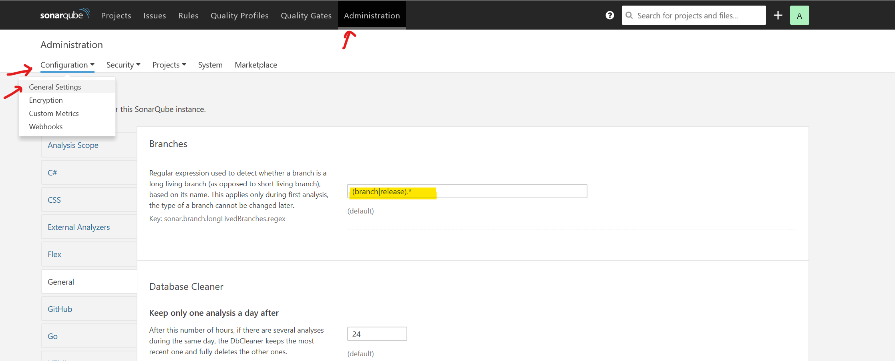

# Simple SonarQube Setup

## Quick Start

### Clone repo

```bash
git clone ssh://git@atlassian.metsci.com:7999/~vasak/simple-sonar.git
```

### Build and start the containers

```bash
docker-compose up
```

You'll the logs from both the DB and SonarQube containers starting. There's a lot of initial setup, but you'll eventually see `SonarQube is up`, at which point you can start using the tools.

### You may see an error along the line of "Max virtual memory areas vm.max_map_count [65530] is too low, increase to at least [262144]"

If encounted insert the new entry into the /etc/sysctl.conf file with the required parameter:
vm.max_map_count = 262144

This will make the changes permanent

Then run:

sysctl -w vm.max_map_count=262144

change current state of kernel.

Make sure to restart Docker for this to take effect:

systemctl restart docker

### View the service

Navigate to [http://localhost:9000](http://localhost:9000) and ensure the service is up. Login with the default user/pass: `admin`/`admin`.

### Setup your long-running branch prefix

Configure the branch plugin to specify what is a long-running branch (master and production branches) under `Administration > System > General`



Set the highlighted regex to: `(branch|release|feature/).*` or whatever your pattern may be.

### Baseline long-running branches

Build your long-running branches and push to your local SonarQube (redo when they change):

```bash
git co master
mvn clean install
mvn sonar:sonar -Dsonar.host.url=http://localhost:9000 -Dsonar.branch.name=master

git co feature/mcs
mvn clean install
mvn sonar:sonar -Dsonar.host.url=http://localhost:9000 -Dsonar.branch.name=feature/mcs
```

### Evaluate short-term branches

Build short-term branches and push to SonarQube, indicating the merge target to get a differential analysis:

```bash
git co fix-issue
mvn clean install
mvn sonar:sonar -Dsonar.host.url=http://localhost:9000 -Dsonar.branch.name=fix-issue -Dsonar.branch.target=feature/mcs
```

### Stoppping

Just `Ctrl-C` in the window with the container logs to stop. Your configuration/data is stored in Docker volumes and will not be lost. Just restart with `docker-compose up` later.

## Additional Notes

### Configure sonar in `.m2/settings.xml`

Add to `<profiles>...</profiles>` block:

```xml
        <profile>
            <id>sonar</id>
            <activation>
                <activeByDefault>true</activeByDefault>
            </activation>
            <properties>
                <sonar.host.url>
                    http://localhost:9000
                </sonar.host.url>
            </properties>
        </profile>
```

### Run in the background

Use the `-d` option to `docker-compose`. The `logs` subcommand will give you access to logs, if needed. Stop and clean up with the `down` command:

```bash
% docker-compose up -d
Starting 02a5c1f404ac_sonarqube   ... done
Starting 8d77ca5d5167_sq-postgres ... done
% docker-compose logs -f
Attaching to 02a5c1f404ac_sonarqube, 8d77ca5d5167_sq-postgres
...
Ctrl-C
% docker-compose down
Stopping 02a5c1f404ac_sonarqube   ... done
Stopping 8d77ca5d5167_sq-postgres ... done
Removing 02a5c1f404ac_sonarqube   ... done
Removing 8d77ca5d5167_sq-postgres ... done
Removing network simple-sonar_default
```
